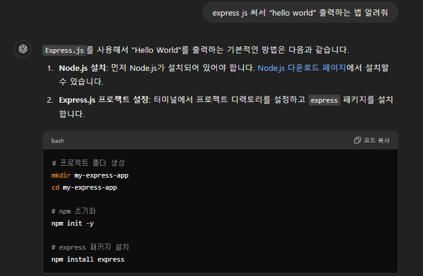
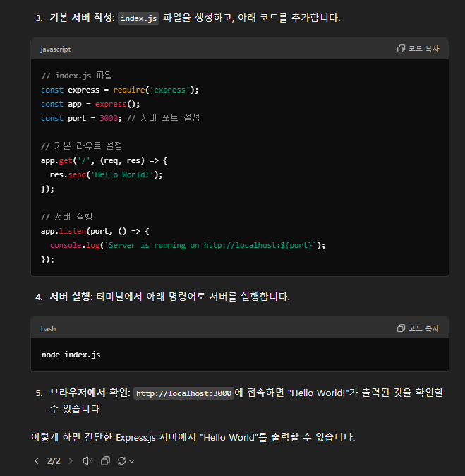
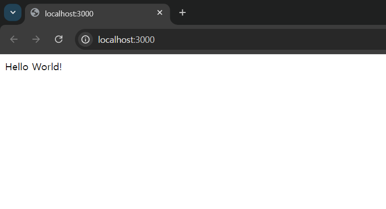

# Week1. Introduction

## 과제내용: 스타터 코드 받기

풀스택 강의에서 사용할 언어/프레임워크 한 가지를 선택하여, 스타터 코드를 받고 실행시켜보기

## 결과

### 1. GPT에게 물어보기

### 2. 실행 결과

- 코드는 [여기](https://github.com/GPbl-AI/assignment-haram/tree/main/book1/my-express-app)를 확인해주세요!
