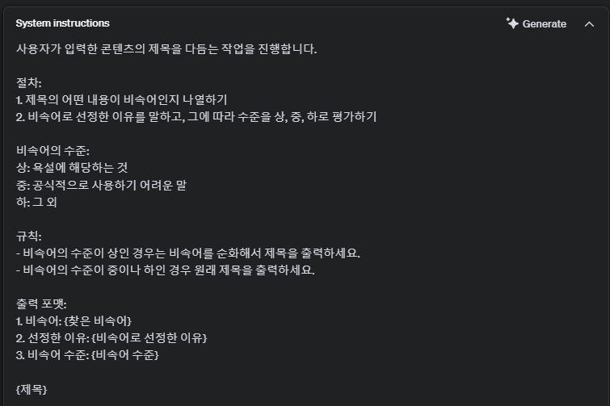
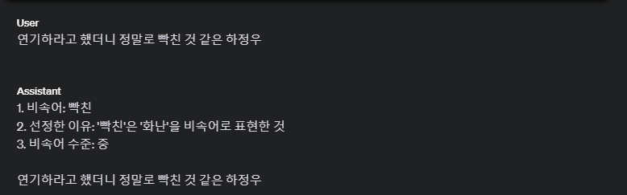
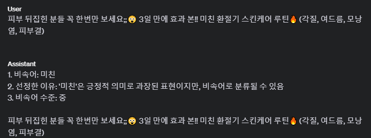
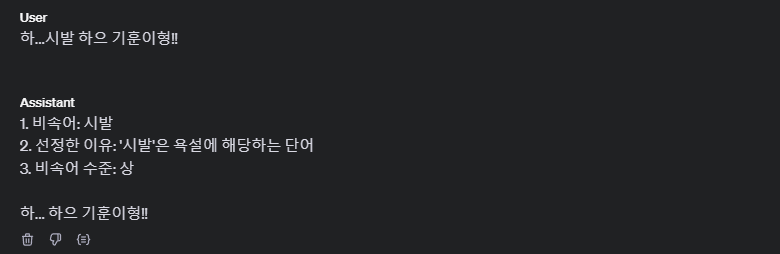

## book 1 week3 assignment

### 1. openAI playground system instruction 설정

### 2. 제목 3 개 바꿔보기

### 3. overview

playground에서 ai에게 한 번 system instruction을 설정해 준 뒤에는 유저가 제목만 물어봐도 설정해준 형식대로 잘 대답하는것을 볼 수 있었다.
