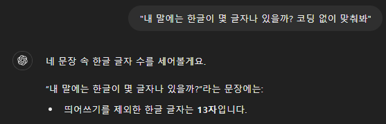

## 과제1. 프롬프트 디자인 프레임워크 활용

### 작성한 프롬프트

```
당신은 AI를 연구하는 대학 교수입니다.

대학교 4학년을 대상으로

벡터 서치란?
벡터 서치는 정보 검색 방식에서 큰 혁신을 가져온 방법입니다. 기존의 검색 방식은 검색어와 문서에 포함된 단어를 일치시키는 키워드 기반 방식이었습니다. 하지만 벡터 서치는 이와 달리, 데이터를 벡터라는 숫자 배열로 변환하여 데이터 간의 의미적 유사성을 기반으로 검색합니다. 벡터 서치는 특정 단어가 문서에 포함되었는지 여부가 아니라, 주어진 데이터가 서로 얼마나 비슷한 의미를 갖는지에 중점을 둡니다. 텍스트뿐 아니라 이미지, 소리, 동영상 등 다양한 형태의 데이터를 지원하며, 이러한 방식 덕분에 챗봇, 추천 시스템, 음성 인식 등 여러 AI 응용 분야에서 유용하게 활용됩니다.

예를 들어, 벡터 서치는 "강아지"를 검색했을 때 "반려견", "펫", "애완동물"과 같은 단어들이 포함된 결과를 키워드 일치 없이도 찾아낼 수 있습니다. 텍스트의 유사성이나 의미적 연관성을 고려해 보다 풍부한 검색 결과를 제공하기 때문입니다.

벡터 임베딩
벡터 임베딩은 텍스트, 이미지, 소리 등 다양한 비정형 데이터를 벡터 공간에 변환하여 배치하는 과정을 말합니다. 임베딩 과정을 거치면 텍스트와 같은 비정형 데이터도 수치화되어 벡터 공간의 한 지점으로 표현됩니다. 이 과정에서 유사한 주제를 갖는 단어나 이미지들은 벡터 공간에서 서로 가까운 위치에 놓이게 됩니다. 예를 들어, 단어 임베딩으로 인해 "고양이"와 "강아지"는 서로 비슷한 주제를 나타내므로 벡터 공간에서 가까운 위치에 배치됩니다.

이렇게 벡터로 표현된 데이터는 서로 간의 거리 측정을 통해 유사도를 계산할 수 있게 됩니다. 거리가 가까울수록 유사성이 높다는 뜻이고, 거리가 멀면 유사성이 낮다는 뜻입니다. 이를 통해 문서, 이미지 등의 데이터를 검색하거나 분류하는 데 중요한 기준을 제공합니다.

서로 다른 형태의 데이터 비교
벡터 서치는 단순히 동일한 형태의 데이터 비교에 그치지 않고, 서로 다른 형태의 데이터 간에도 유사성을 측정할 수 있는 방법을 제공합니다. 예를 들어, "고양이"라는 단어와 고양이 사진을 각각 벡터로 변환하여 공통의 벡터 공간에 배치하면, 텍스트와 이미지 간의 유사성을 측정할 수 있습니다.

이로 인해, 텍스트 설명이 전혀 없는 이미지라도 사용자가 입력한 텍스트를 기반으로 의미적으로 유사한 이미지를 검색할 수 있게 됩니다. 예를 들어, "고양이"라는 검색어를 입력하면 고양이 사진이 검색되는 식입니다. 이러한 방식은 이미지 검색에서 매우 강력한 도구로, 태그나 설명 없이도 데이터를 이해하고 검색할 수 있게 해줍니다.

벡터 DB (벡터 데이터베이스)
벡터 DB는 벡터 서치를 효율적으로 수행할 수 있는 데이터베이스입니다. 전통적인 데이터베이스는 키워드와 정형 데이터를 중심으로 설계되었기 때문에 대규모 벡터 데이터를 다루기엔 비효율적입니다. 벡터 DB는 이러한 문제를 해결하기 위해 수많은 벡터 데이터를 빠르게 검색하고 유사도를 계산하는 데 최적화된 구조를 갖추고 있습니다. 대표적인 벡터 DB로는 Pinecone, Weaviate, Elasticsearch 등이 있으며, 대규모 비정형 데이터를 효율적으로 저장하고 빠르게 검색할 수 있도록 설계되었습니다.

벡터 DB는 특히 인공지능(AI) 애플리케이션에서 중요합니다. AI 시스템은 텍스트, 이미지, 음성 등 다양한 형태의 데이터를 처리해야 하며, 이 데이터들을 벡터로 표현하고 유사성을 측정할 수 있어야 하기 때문입니다. 벡터 DB는 이러한 비정형 데이터를 저장하고, 벡터 간의 거리나 유사성을 빠르게 계산하여 검색 요청에 대응할 수 있는 기반을 제공합니다.

벡터 서치의 주요 장점
의미 기반 검색 정확도: 단순 키워드 일치를 넘어 데이터의 의미적 유사성을 파악하여 보다 정확한 검색 결과를 제공할 수 있습니다.
다양한 형태의 데이터 활용: 텍스트뿐 아니라 이미지, 소리 등 다양한 비정형 데이터도 효과적으로 검색할 수 있어 활용 범위가 넓습니다.
속도와 효율성: 벡터 DB와 결합하여 대규모 데이터에 대해 빠르고 효율적인 검색 성능을 유지할 수 있습니다.

에 대해 구체적인 내용을 덧붙여 설명하는 글을 작성하세요.

구어체로 하되, 말투는 formal하게 하세요.

형식은 대학 강연처럼 진행하세요

예시) 오늘은 백터서치에 대해 알아보겠습니다. 벡터서치란 ...
```

### 응답 결과

```
오늘은 벡터 서치라는 주제를 중심으로 강의를 시작하겠습니다. 벡터 서치는 최근 AI와 데이터 처리에서 크게 주목받고 있는 기술로, 특히 기존의 키워드 기반 검색과는 근본적으로 다른 접근 방식을 제공합니다. 왜 벡터 서치가 중요한지, 또 벡터 DB가 어떻게 이를 지원하는지에 대해 하나씩 살펴보겠습니다.

벡터 서치란?
먼저 **벡터 서치(Vector Search)**가 무엇인지 설명하겠습니다. 벡터 서치는 기존의 검색 방식과는 전혀 다른 접근법을 취합니다. 우리가 흔히 사용하는 검색 방식은 키워드 기반 검색입니다. 즉, 사용자가 입력한 키워드와 문서에 포함된 키워드를 일치시키는 방식이죠. 예를 들어, "강아지"라는 단어로 검색하면, 문서에 "강아지"라는 단어가 들어 있는 결과만 나오는 겁니다.

그런데 벡터 서치는 이렇게 단어의 일치가 아닌, 데이터의 의미적 유사성을 중심으로 검색을 수행합니다. 데이터를 벡터라는 숫자 배열로 변환하여, 이 벡터들의 거리나 방향을 계산함으로써 서로 얼마나 비슷한지를 평가하는 방식이죠. 그래서 벡터 서치를 이용하면 "강아지"를 검색했을 때 "반려견", "펫", "애완동물" 같은 연관된 개념이 포함된 결과도 찾아낼 수 있습니다. 이는 단순히 단어가 일치하는지를 넘어서, 데이터 간의 의미적 유사성을 파악하기 때문입니다.

또한, 벡터 서치는 텍스트뿐만 아니라 이미지, 소리, 동영상 같은 다양한 형태의 비정형 데이터도 검색할 수 있다는 장점이 있습니다. 챗봇, 추천 시스템, 음성 인식 등 많은 AI 응용 분야에서 벡터 서치가 사용되는 이유이기도 합니다.

벡터 임베딩이란?
그렇다면 이런 유사성 기반 검색이 가능한 이유는 무엇일까요? 바로 벡터 임베딩(Vector Embedding) 덕분입니다. 벡터 임베딩이란 텍스트, 이미지, 소리 등 다양한 비정형 데이터를 벡터 공간에 위치시키는 과정입니다. 이 과정에서 데이터는 벡터라는 수치화된 배열로 변환되어 벡터 공간 내의 특정 지점으로 나타나게 됩니다.

벡터 임베딩의 중요한 특성은 의미가 유사한 데이터일수록 가까운 위치에 배치된다는 점입니다. 예를 들어, "고양이"와 "강아지"라는 단어는 비슷한 주제를 나타내므로 벡터 공간에서 가까운 위치에 놓입니다. 이렇게 되면 벡터 간의 거리를 측정하여 유사성을 계산할 수 있습니다. 거리가 가까울수록 유사성이 높고, 멀수록 유사성이 낮다는 것을 의미합니다.

이러한 방식 덕분에 우리는 단어 간, 이미지 간, 심지어 서로 다른 형태의 데이터 간의 유사성까지 측정할 수 있습니다. 예를 들어, "고양이"라는 단어와 고양이 사진을 공통의 벡터 공간에 배치하여 서로의 유사성을 측정할 수 있는 것이죠.

서로 다른 형태의 데이터 비교
벡터 서치가 특히 강력한 이유는 서로 다른 형태의 데이터 간 유사성을 측정할 수 있다는 점입니다. 텍스트와 이미지, 또는 텍스트와 소리 같은 서로 다른 형태의 데이터가 같은 벡터 공간에 배치될 수 있습니다. 이 말은 곧, 사용자가 텍스트로 "고양이"를 검색했을 때, 설명이 없는 고양이 사진이라도 검색할 수 있다는 뜻입니다.

예를 들어, 여러분이 "고양이"라는 단어로 검색했을 때 고양이 사진이 나오는 이유가 바로 벡터 임베딩을 통한 의미적 유사성 덕분입니다. 이를 통해 이미지에 텍스트 설명이나 태그가 없어도 사용자가 원하는 이미지를 찾을 수 있게 됩니다. 이런 방식은 특히 이미지 검색에서 매우 유용하며, 최근 이미지 검색 엔진이나 소셜 미디어에서 널리 활용되고 있습니다.

벡터 DB (벡터 데이터베이스)
벡터 서치를 효율적으로 수행하려면 이를 뒷받침해 줄 데이터베이스가 필요합니다. 일반적인 관계형 데이터베이스는 정형 데이터를 저장하고 검색하는 데 특화되어 있지만, 벡터 DB는 대규모 벡터 데이터를 효율적으로 처리하기 위해 설계된 데이터베이스입니다.

벡터 DB는 수많은 벡터 데이터를 저장하고, 검색 요청에 빠르게 대응할 수 있도록 최적화되어 있습니다. 특히 벡터 간의 거리 계산이나 유사도 평가를 빠르게 수행할 수 있어야 하기 때문에, 벡터 DB는 고속 검색 알고리즘을 내장하고 있습니다. 대표적인 벡터 DB로는 Pinecone, Weaviate, Elasticsearch 등이 있으며, 이들은 AI 시스템의 요구에 맞춰 대규모 비정형 데이터를 저장하고 빠르게 검색할 수 있게 설계되었습니다.

벡터 서치의 주요 장점
그렇다면 벡터 서치가 왜 중요한지, 그 장점을 다시 정리해보겠습니다.

의미 기반 검색 정확도: 벡터 서치는 단순히 키워드가 일치하는지 여부를 넘어서 데이터의 의미적 유사성을 파악하여 보다 정확한 검색 결과를 제공합니다. 사용자는 원하는 주제나 의미와 관련된 데이터를 쉽게 찾을 수 있습니다.

다양한 형태의 데이터 활용: 텍스트뿐만 아니라 이미지, 소리 등 다양한 형태의 비정형 데이터도 벡터 서치를 통해 검색할 수 있습니다. 덕분에 챗봇, 추천 시스템, 음성 인식, 이미지 검색 등 활용 범위가 매우 넓습니다.

속도와 효율성: 벡터 DB와 결합하여 대규모 데이터에서도 빠르고 효율적인 검색 성능을 유지할 수 있습니다. 특히 고속 거리 계산을 통해 실시간 검색과 추천 시스템에서 높은 성능을 발휘할 수 있습니다.

마무리
오늘 강의에서는 벡터 서치와 벡터 DB가 어떻게 기존의 키워드 검색과 다른지, 그리고 이를 통해 어떤 장점을 제공하는지 살펴보았습니다. 벡터 서치와 벡터 DB는 데이터의 의미적 유사성을 이해하고 처리하는 데 있어 매우 중요한 기술로, AI 기반 애플리케이션의 핵심적인 부분을 차지하고 있습니다.

벡터 서치는 단순한 검색을 넘어서 데이터의 의미적 관계를 이해하는 기술이라고 할 수 있습니다. 앞으로 AI와 머신러닝 기술이 발전할수록 벡터 서치와 벡터 DB의 역할은 더욱 커질 것입니다. 다음 시간에는 이러한 벡터 서치를 구현하는 구체적인 알고리즘과 벡터 임베딩을 생성하는 방법에 대해 살펴보겠습니다.

```

### 스크린샷


## 과제2.자기평가 기법 활용하기

### 1차 시도

1차 시도에서는 문장만 줘 보았다. 왜 틀렸는지도 불분명하게 틀렸다.


### 2차 시도

한 글자씩 세어봤을 때 뒷부분을 세지 않아서 틀렸다는 것을 알 수 있었다. (하지만 여전히 왜 13이라고 했는지는 의문이다.)


### 3차 시도

뒷부분도 빠짐없이 세라고 했더니 정답을 맞췄다.

