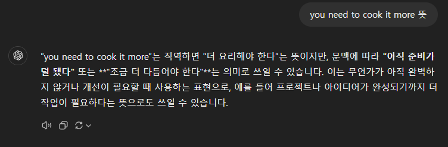
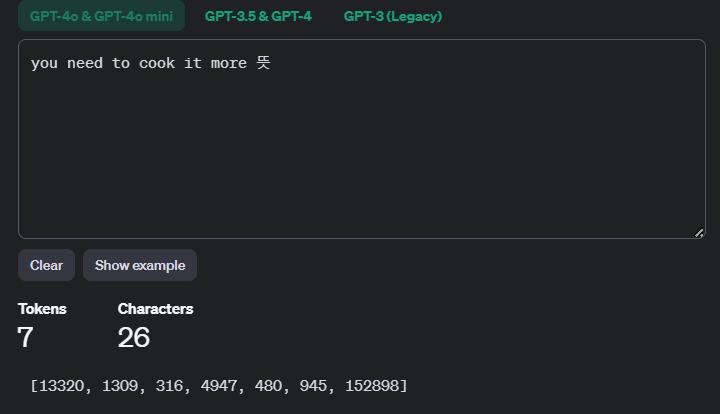
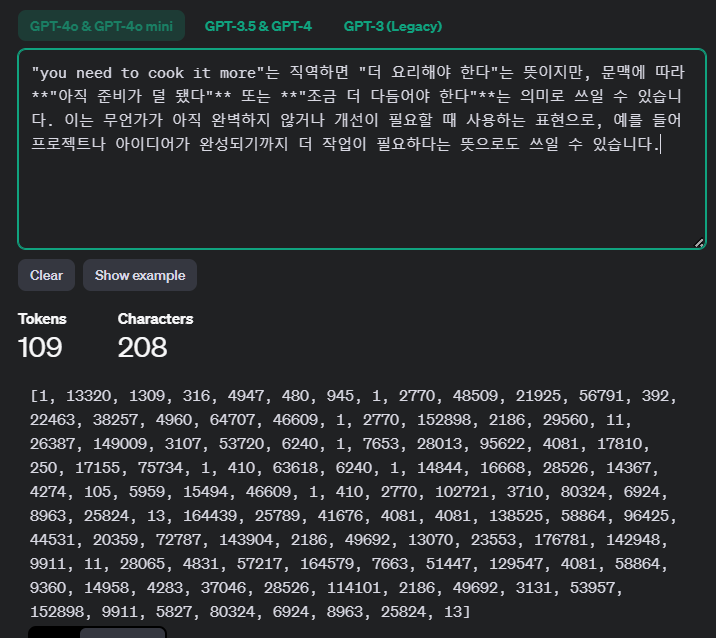
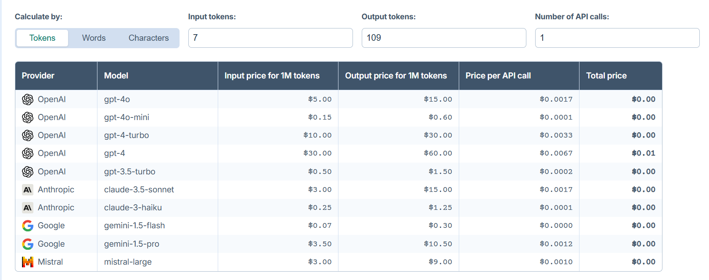
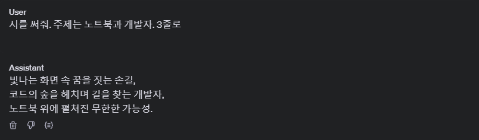
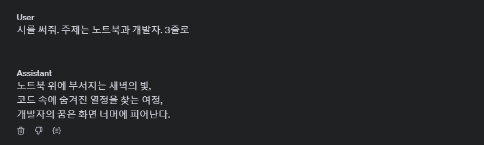
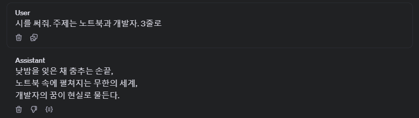

# Week6 - Book1 : Tokenizer 사용하기 & OpenAI Playground 사용하기

## 1. Tokenizer 사용하기

### 가장 마음에 들었던 문답

### Tokenizer를 활용하여 질문과 답변에 대한 토큰이 얼마나 들었는지 확인

### OpenAI GPT API Pricing Calculator에서 본인의 문답 1회에 대한 가격을 확인합니다.

gpt-4o는 0.0017\$ , gpt-4o-mini 는 0.0001\$ 이다.

## 2. OpenAI Playground 사용하기 - 시인이 되어 시를 쓰기

### 질문

> 프로그래머의 삶에 대해 해학적이고 재치있는 창의적인 시를 쓰세요. 4연정도의 짧은 길이로 라임을 살려야합니다.

### 생성 옵션을 변경해가며 어떠한 효과적인 변화가 있는지 분석하기

1. 시 쓰기 (온도 0, Top P 0, Frequency penalty 0, Presence penalty 0)
   
2. 시 쓰기 (온도 1.0, Top P 1.0, Frequency penalty 0, Presence penalty 0)
   
3. 시 쓰기 (온도 1.0, Top P 1.0, Frequency penalty 2.0, Presence penalty 2.0)
   

### 평가

1. 온도 1.0은 표현의 자유도가 높아져서 참신하거나 예상 밖의 단어 선택으로 “새벽의 빛,” “화면 너머에 피어난다”와 같은 표현들이 나타나면서 시가 더 상징적이고 감성적으로 보일 수 있게 된다.
2. Top P를 1.0으로 설정하면 가능한 단어를 모두 고려하므로 표현의 다양성이 커질수 있다.
3. Frequency penalty와 Presence penalty를 높이면 이미 나온 단어나 비슷한 어휘를 피하게 되어, 표현이 좀 더 간결하고 압축적이면서 새로운 단어로 채워진다.따라서 두 번째 예시에서는 “코드”나 “꿈” 같은 단어가 반복되지 않고, 대신 새로운 표현이 나타난다.
4. 결론적으로 시 쓰기에 중요한 요소는 온도와 Top P가 가져오는 창의성과 표현의 폭, 그리고 Frequency 및 Presence penalty가 가져오는 어휘의 신선함과 간결성
