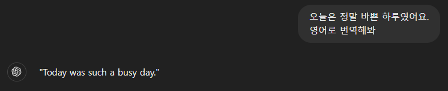
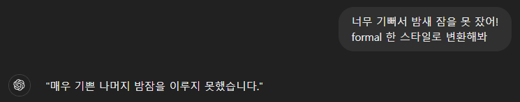
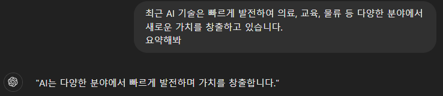
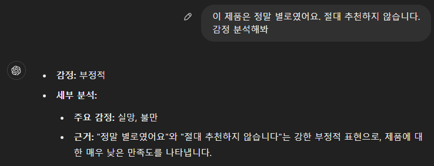
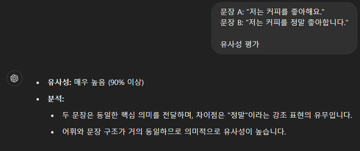
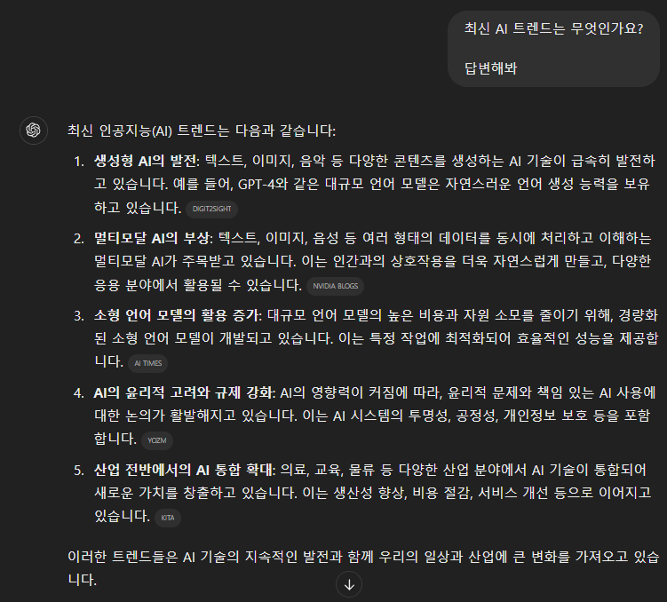

# 과제 제출

## 1. **텍스트 생성 및 번역**

- **임의의 문장 작성 및 번역:**
  
- **문장 스타일 변환:**
  

## 2. **요약**

## 3. **감정 분석**

## 4. **유사성 평가**

## 5. **질문 답변 (QA)**

## **활용된 NLP 기법**

1. **텍스트 생성 및 번역:**

   - 번역: 언어 모델을 사용해 문장을 다른 언어로 변환.
   - 스타일 변환: 문체 변환 알고리즘 활용.

2. **요약:**

   - 텍스트 요약 알고리즘을 사용해 긴 문장에서 핵심 정보만 추출.

3. **감정 분석:**

   - 문장에서 긍정, 부정, 중립 감정을 추출하는 분류 기법 사용.

4. **유사성 평가:**

   - 코사인 유사도 등 텍스트 간 의미 유사도를 평가하는 알고리즘 활용.

5. **질문 답변:**
   - QA 모델로 질문의 의도를 파악하고 해당 답을 생성하는 기술 사용.
