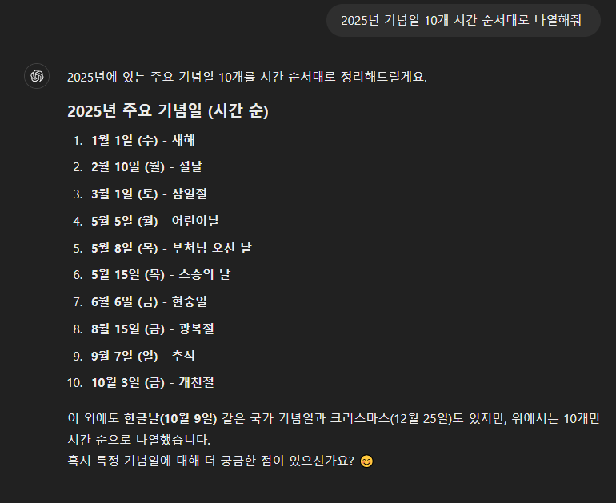
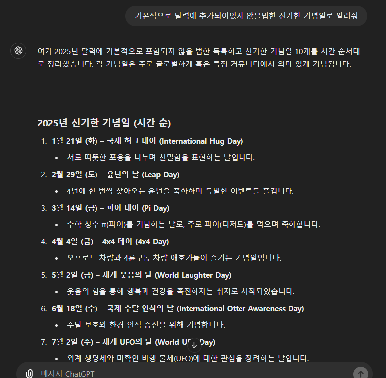
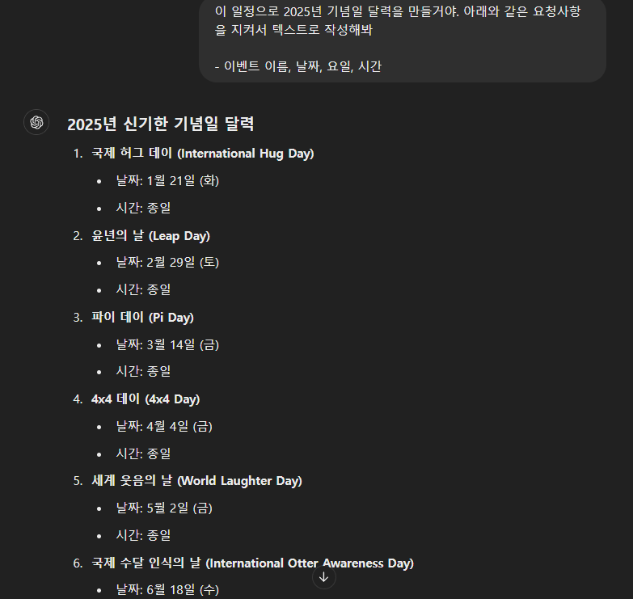
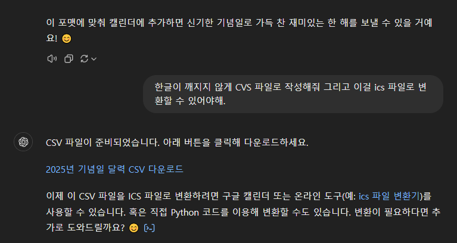
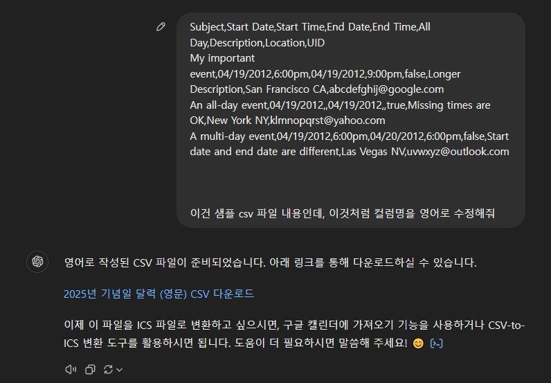
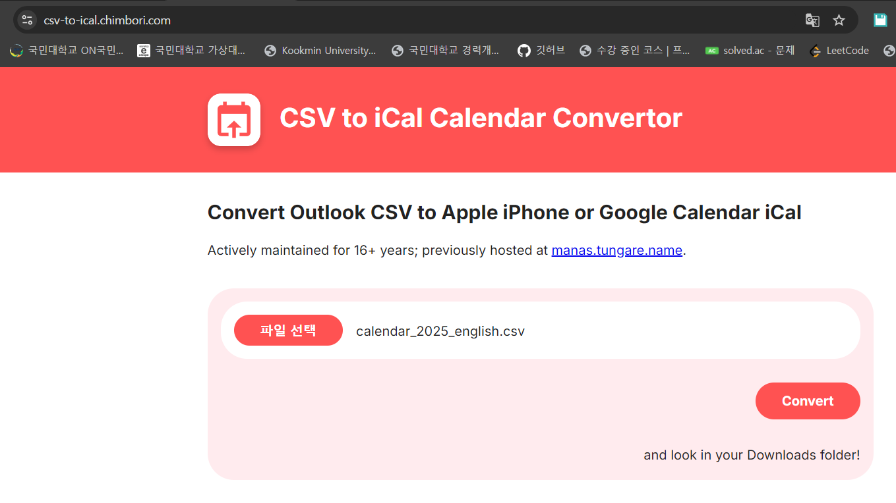
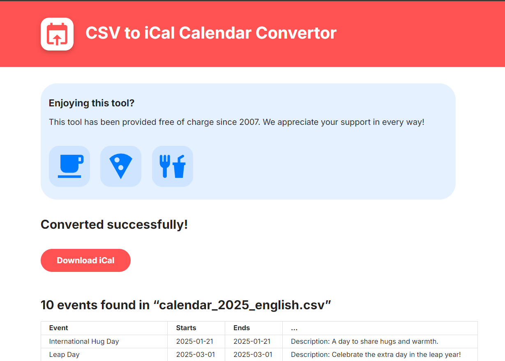
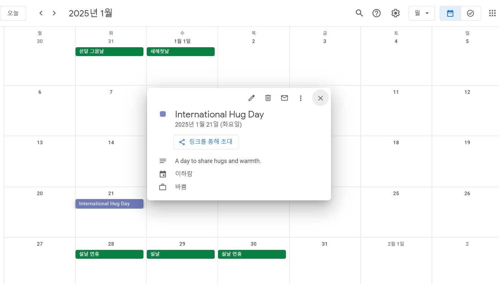

## 과제

- [챗GPT 대화 공유 링크](https://chatgpt.com/share/e/670defdf-cdc0-8012-87ec-5181b1adb1bb)

### 대화 과정 스크린샷

> 여기서 ICS 파일로 변환이 안되길래 다시 시켜보았다.
> 

> 구글 캘린더에 잘 적용 된 모습!

- 생성된 CSV 파일: ./이하람\_anniversary.csv
