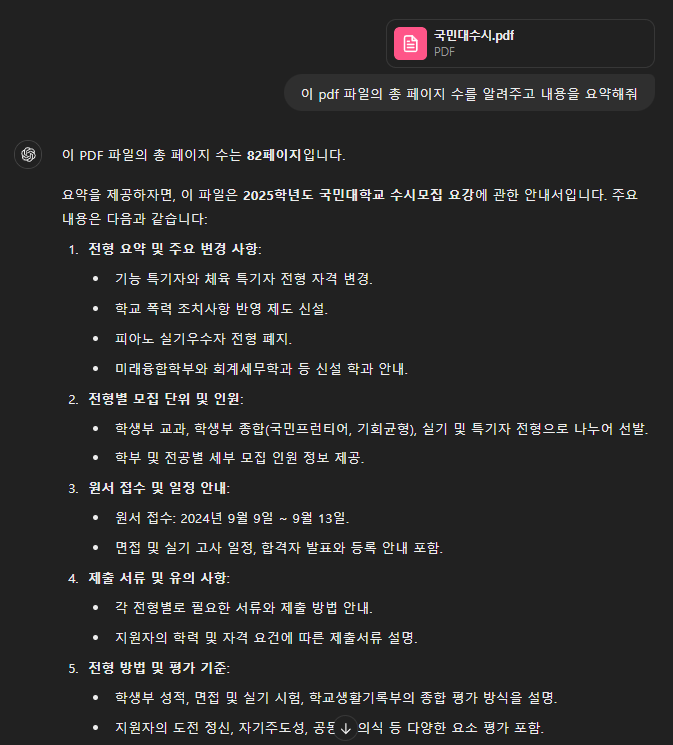
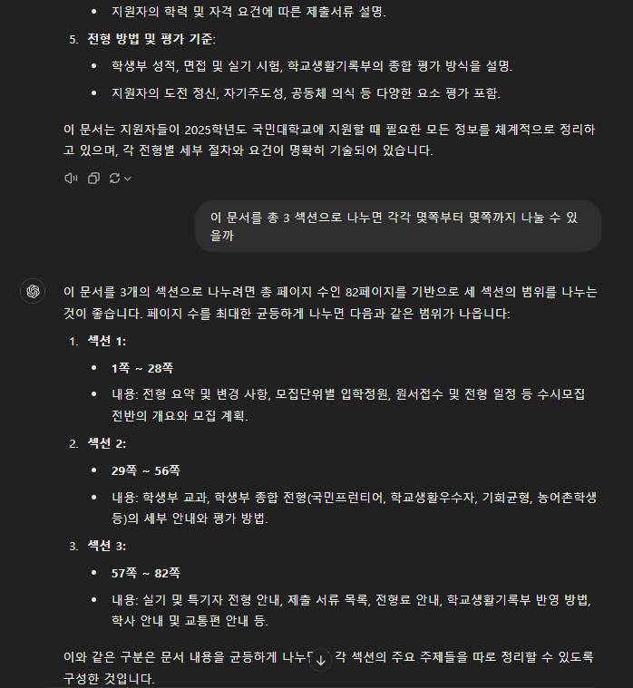
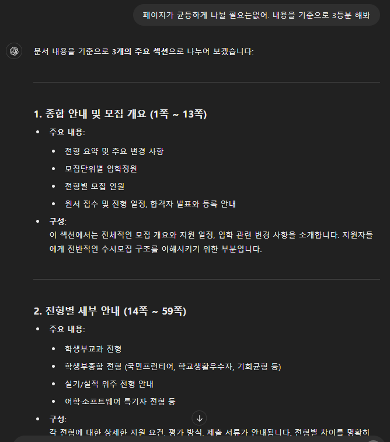
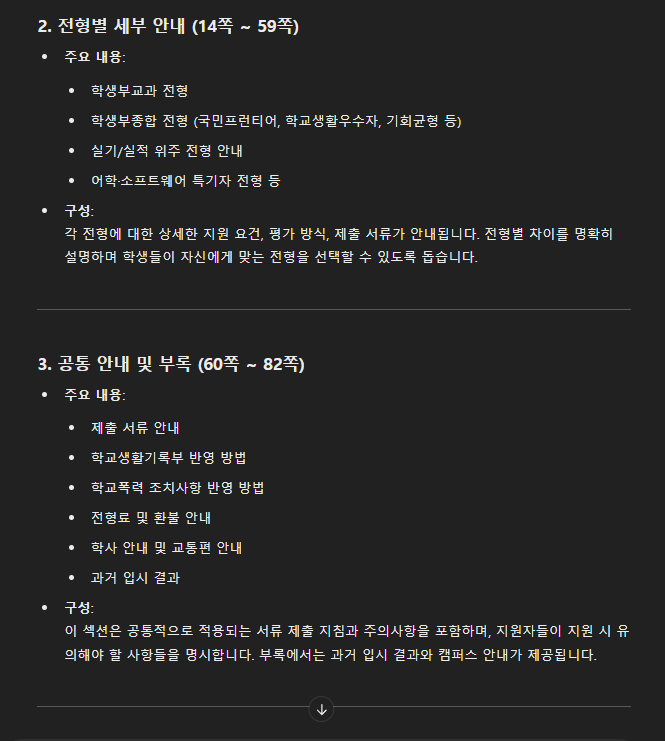
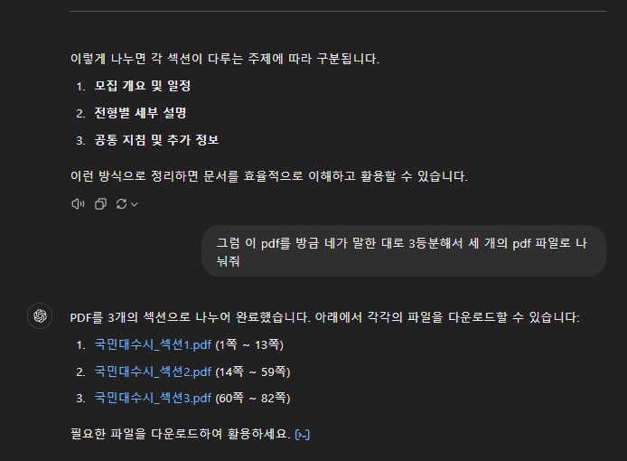
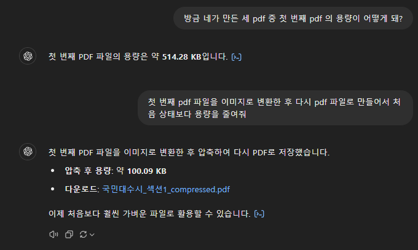
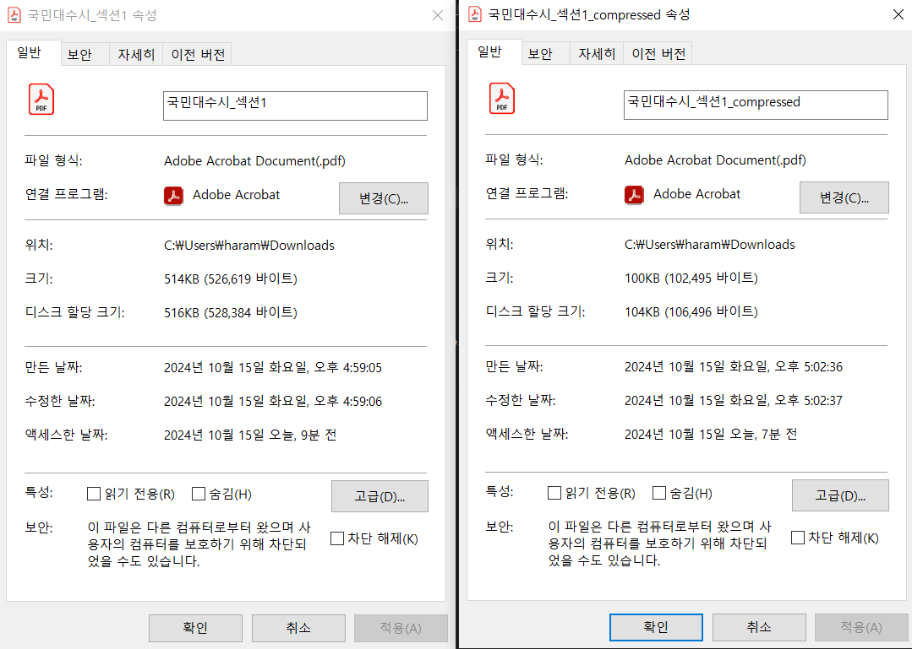
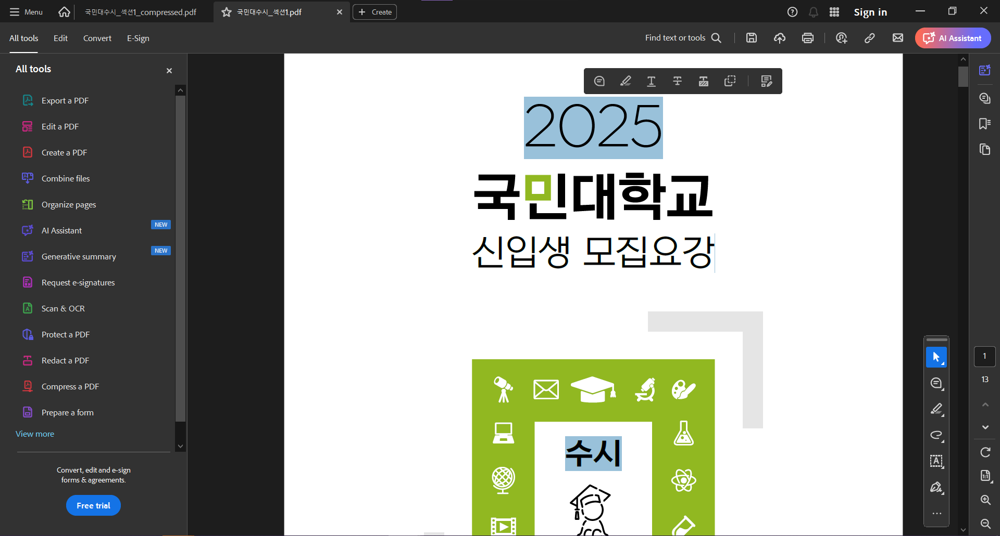
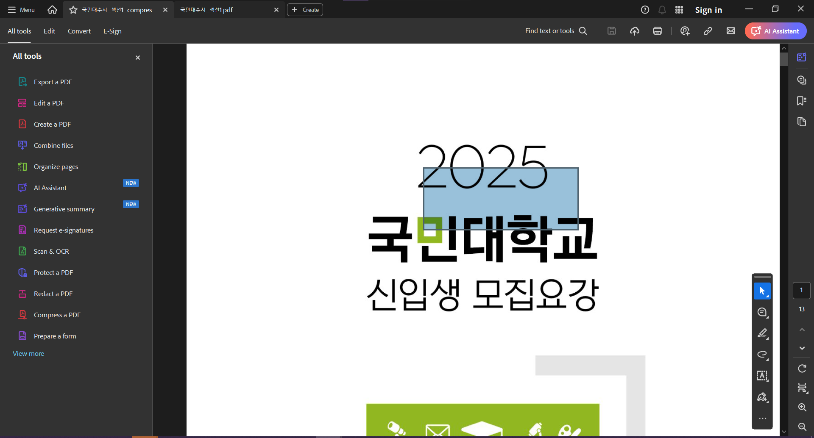

## book2 week4 assignment

1. PDF 파일을 ChatGPT를 이용해서 자율적인 범위로 3등분하기 (예: 국민대학교 수시 혹은 정시 요람 등)
2. 3등분한 PDF 파일 중 하나를 ChatGPT를 이용하여 이미지로 변환하기

### PDF 파일을 3등분하기

1. 먼저 PDF 파일을 한 개 올리고 페이지수, 내용 요약을 요구했다.
   (원래 의도했던 것은 몇 쪽 부터 몇 쪽 까지 무슨 내용인지 요약하도록 하고 싶었지만 처음부터 의도대로 결과가 나오진 않았다.)
2. PDF를 세 부분으로 나눈 파일을 다운받을 수 있었다.
   
   
   
   
   

### PDF 파일 이미지로 변환, 용량 최적화하기

1. 첫 번째 파일을 이미지로 바꿔서 최적화했다.
2. 최적화 이전 용량과 이후 용량을 비교하도록 요구했고, 정확한 답변을 얻을 수 있었다.

> 파일을 열고 비교했을 때 압축하기 전엔 텍스트로 인식되던 부분이 이미지로 인식되고있다.
>  

### 결과물

- [원본 파일 `./국민대수시.pdf`](./국민대수시.pdf)
- [`./국민대수시_섹션1.pdf`](./국민대수시_섹션1.pdf)
- [`./국민대수시_섹션2.pdf`](./국민대수시_섹션2.pdf)
- [`./국민대수시_섹션3.pdf`](./국민대수시_섹션3.pdf)
- [`./국민대수시_섹션1_compressed.pdf`](./국민대수시_섹션1_compressed.pdf)
