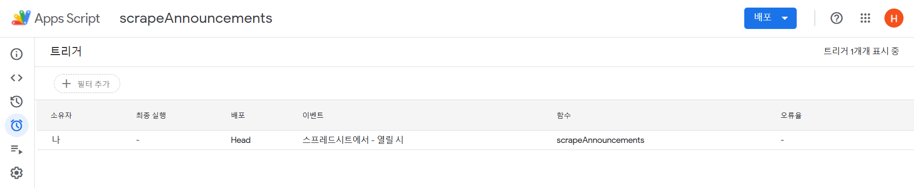

## book2 week4 assignment1

1. PDF 파일을 ChatGPT를 이용해서 자율적인 범위로 3등분하기 (예: 국민대학교 수시 혹은 정시 요람 등)
2. 3등분한 PDF 파일 중 하나를 ChatGPT를 이용하여 이미지로 변환하기

### PDF 파일을 3등분하기

1. 먼저 PDF 파일을 한 개 올리고 페이지수, 내용 요약을 요구했다.
   (원래 의도했던 것은 몇 쪽 부터 몇 쪽 까지 무슨 내용인지 요약하도록 하고 싶었지만 처음부터 의도대로 결과가 나오진 않았다.)
2. PDF를 세 부분으로 나눈 파일을 다운받을 수 있었다.
   
   
   
   
   

### PDF 파일 이미지로 변환, 용량 최적화하기

1. 첫 번째 파일을 이미지로 바꿔서 최적화했다.
2. 최적화 이전 용량과 이후 용량을 비교하도록 요구했고, 정확한 답변을 얻을 수 있었다.


> 파일을 열고 비교했을 때 압축하기 전엔 텍스트로 인식되던 부분이 이미지로 인식되고있다.
>  

### 결과물

- [원본 파일 `./국민대수시.pdf`](./국민대수시.pdf)
- [`./국민대수시_섹션1.pdf`](./국민대수시_섹션1.pdf)
- [`./국민대수시_섹션2.pdf`](./국민대수시_섹션2.pdf)
- [`./국민대수시_섹션3.pdf`](./국민대수시_섹션3.pdf)
- [`./국민대수시_섹션1_compressed.pdf`](./국민대수시_섹션1_compressed.pdf)

## book2 week4 assignment2

1. 원하는 웹사이트의 특정 파트를 웹스크래핑 해보기 (예: 국민대학교 소융대 공지사항 상위 10개 등). Google Sheets 내의 App Script를 사용해서 진행한다. 진행 과정에서 ChatGPT의 도움을 받는다.
2. 만약 진행이 되지 않는다면, 시도한 과정을 스크린샷을 첨부하여 설명한다. 그후 App Script를 이용하여 Google Sheet 내의 Sum 함수를 만들어보고, 진행과정과 결과물을 스크린샷으로 담아 PDF에 첨부한다.
   웹스크래핑은 ChatGPT의 도움을 받아 파이썬 등 다른 툴로 진행하고, 마찬가지로 과정과 결과를 PDF에 이미지 자료와 함께 첨부한다.

### GPT 이용한 스크립트 생성

처음 아무런 가이드라인 없이 명령했을 땐 정확한 코드를 생성하지 못했지만, 다음 시도에서 타겟 url과 html 형식을 제공했더니 정확하게 잘 돌아가는 코드를 제시했다.


```javascript
function scrapeAnnouncements() {
  const url = "https://cs.kookmin.ac.kr/news/notice/"; // 국민대학교 소융대 공지사항 URL
  const sheetName = "AI-week4-과제-공지사항"; // 데이터를 저장할 시트 이름
  const spreadsheet = SpreadsheetApp.getActiveSpreadsheet();
  let sheet = spreadsheet.getSheetByName(sheetName);

  // 시트가 없는 경우 새 시트 생성
  if (!sheet) {
    sheet = spreadsheet.insertSheet(sheetName);
  }

  const response = UrlFetchApp.fetch(url, { muteHttpExceptions: true });
  const html = response.getContentText();

  // 공지사항 제목과 링크를 파싱할 정규표현식
  const regex =
    /<li class="subject" style="width:40%"><a href="(.*?)">(.*?)<\/a><\/li>/g;

  // 기존 데이터 삭제
  sheet.clear();
  sheet.appendRow(["제목", "링크"]);

  let match;
  let count = 0;

  // 정규표현식으로 공지사항 제목과 링크 찾기
  while ((match = regex.exec(html)) !== null && count < 10) {
    const link = match[1];
    const title = match[2];
    sheet.appendRow([title, "https://cs.kookmin.ac.kr/news/notice/" + link]);
    count++;
  }

  if (count === 0) {
    Logger.log("공지사항을 찾을 수 없습니다.");
  }
}
```

### GCC 프로젝트 생성하고 Oauth 동의하기

스프레드 시트 파일을 열 때 마다 코드를 실행시키기 위해 트리거를 생성하려면 구글 클라우드 콘솔에서 프로젝트를 생성하고 Oauth 동의를 해줘야한다.




### 결과


