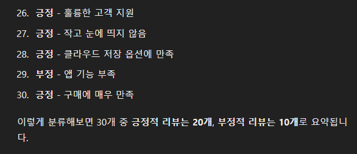

# 앱(혹은 상품)리뷰 분석 + 부정 리뷰 개선 전략 보고서 작성하기

## 1. 분석 대상

‘자신이 하고 있는 프로젝트’와 관련된 하나 또는 둘 이상의 앱 또는 상품

### 대상: Dog-Camera 상품 리뷰 분석

[링크](https://www.amazon.com/Kasa-Smart-Home-Security-Camera/dp/B08GHX9G5L/ref=sr_1_7?crid=25Z4IJOYDU5CO&dib=eyJ2IjoiMSJ9.AwFzNTMkBHW9y2JXYjD8_BMQndMc1PRq7uvRxA6A98xMyw_O5P5GERZfJZuOVn-2z_royMK7ILI0t0SO--miqvOSWBAyPWwadJCEqQ_y6pw_YNeMuk8V3HzttnF6KRRwkvDP6qFBWKx2PVIsG1TSrcq3F0IhKwwBcxcnfhIyxTr04hD_VKnBi8vwY6iQNNu13lWbVf7iJbC8O0SOVk-6ZXpjY2xaLmFv6FWYGcmmKR7yttJF9itUjDu1EyRZycOylNgrGmiojd2K38NfXAfe9rNe-KuLQnGJuwHzKEQJEHc.J5tHOvwP5MsMmg2Thcc7YZhH_iaCSg1l-Rnxp65Geic&dib_tag=se&keywords=dog&qid=1731439719&sprefix=dog%2Caps%2C146&sr=8-7&th=1)

## 2. 분석 방법

‘최소 30건 이상의 리뷰를 수집하고 분석할 것
긍정/부정 리뷰를 분류할 때 도움을 줄 수 있는 추가 프롬프트를 사용할 것
여러 개의 부정 리뷰의 개선 전략 중 하나의 전략에 집중할 것

### 리뷰 30개 수집

1. **5.0 out of 5 stars**  
   Excelente cámara de vigilancia! Muy fácil de instalar, se ve muy nítida la imagen, además se pueden escuchar las voces o ruidos que haya en el lugar y también se puede hablar por medio de la cámara; excelente compra! La recomiendo mucho!

2. **5.0 out of 5 stars**  
   Great camera for the price. Easy to set up and the app is user-friendly. The picture quality is excellent, and the night vision works well.

3. **4.0 out of 5 stars**  
   Good camera but the motion detection is a bit too sensitive. I get notifications for every little movement.

4. **5.0 out of 5 stars**  
   I love this camera! It was easy to install and the app makes it simple to monitor my home when I'm away.

5. **3.0 out of 5 stars**  
   The camera works fine, but the app crashes occasionally. Hope they fix this issue soon.

6. **5.0 out of 5 stars**  
   Excellent value for money. The two-way audio is clear, and the video quality is sharp.

7. **4.0 out of 5 stars**  
   Good camera overall, but the setup process was a bit confusing.

8. **5.0 out of 5 stars**  
   Works perfectly! I can check on my pets while I'm at work.

9. **2.0 out of 5 stars**  
   The camera stopped working after a month. Disappointed with the durability.

10. **5.0 out of 5 stars**  
    Great product! The motion detection is accurate, and the notifications are prompt.

11. **4.0 out of 5 stars**  
    The camera is good, but the power cord is too short for my needs.

12. **5.0 out of 5 stars**  
    I bought two of these cameras, and they both work flawlessly.

13. **3.0 out of 5 stars**  
    The video quality is decent, but the audio has a slight delay.

14. **5.0 out of 5 stars**  
    Highly recommend! Easy to use and reliable.

15. **4.0 out of 5 stars**  
    Good camera, but the app could use some improvements.

16. **5.0 out of 5 stars**  
    Perfect for monitoring my baby’s room.

17. **2.0 out of 5 stars**  
    The camera frequently disconnects from Wi-Fi.

18. **5.0 out of 5 stars**  
    Affordable and effective security solution.

19. **4.0 out of 5 stars**  
    Satisfied with the purchase, but wish it had a wider field of view.

20. **5.0 out of 5 stars**  
    The night vision is impressive.

21. **3.0 out of 5 stars**  
    It's okay, but I've seen better cameras at this price point.

22. **5.0 out of 5 stars**  
    The app interface is intuitive and easy to navigate.

23. **4.0 out of 5 stars**  
    Good for indoor use, but not suitable for outdoor surveillance.

24. **5.0 out of 5 stars**  
    The motion tracking feature works well.

25. **2.0 out of 5 stars**  
    Had issues with the initial setup.

26. **5.0 out of 5 stars**  
    Great customer support.

27. **4.0 out of 5 stars**  
    The camera is compact and unobtrusive.

28. **5.0 out of 5 stars**  
    Love the cloud storage option.

29. **3.0 out of 5 stars**  
    The app needs more features.

30. **5.0 out of 5 stars**  
    Very happy with this purchase.

### 긍정, 부정 분류

```
각 리뷰에 대해, 코딩 없이 부정 긍정을 검사해줘
```



### 개선 전략 찾기

```
부정적인 리뷰들의 피드백을 반영해 개선할 수 있는 점이 뭐가있을까
```

1. **모션 감지 민감도 조정 기능 개선**

   - 모션 감지가 너무 민감하다는 피드백이 있으므로, 감지 민감도를 세밀하게 조정할 수 있는 설정 옵션을 추가하거나, AI 기반으로 사람이나 특정 움직임만 감지하는 기능을 도입하면 불필요한 알림을 줄일 수 있습니다.

2. **앱 안정성 및 기능 향상**

   - 앱 충돌 문제와 기능 부족을 호소하는 리뷰가 여러 개 있으므로, 앱을 더 안정적으로 업데이트하고 기능성을 확장하는 것이 중요합니다. 예를 들어, 사용자 맞춤형 인터페이스 옵션이나 더 다양한 모니터링 및 보안 기능을 추가할 수 있습니다.

3. **Wi-Fi 연결 문제 해결**

   - Wi-Fi 연결 불안정 문제를 해결하기 위해, 안정적인 연결을 지원할 수 있는 소프트웨어 최적화 또는 하드웨어 개선을 고려할 수 있습니다. 또한, 연결이 끊겼을 때 자동으로 재연결하는 기능도 유용합니다.

4. **야외 사용 개선**

   - 실내에 적합하다는 피드백에 따라, 방수 및 방진 기능을 추가하여 실외 환경에서도 사용할 수 있는 모델을 개발하면 사용 범위가 넓어질 수 있습니다.

5. **짧은 전원 코드 문제**

   - 설치 위치에 제한이 없도록 전원 코드 길이를 늘리거나, 무선 옵션을 제공하여 사용자가 원하는 위치에 쉽게 설치할 수 있게 개선할 수 있습니다.

6. **내구성 및 품질 관리 강화**

   - 고장이 잦다는 리뷰가 있으므로, 더 엄격한 품질 관리 및 테스트 절차를 통해 제품 내구성을 강화할 수 있습니다.

7. **지연 없는 오디오 성능 개선**
   - 오디오 딜레이에 대한 피드백을 반영하여, 오디오 전송 속도를 높이고 딜레이를 줄이는 기술적 개선을 통해 양방향 오디오의 품질을 높일 수 있습니다.

## 3. 보고서 형식

보고서 형식은 자유롭게 작성 가능
최종 제출 형식은 PDF로 제출

[개선*제안*보고서.pdf](개선_제안_보고서.pdf)
