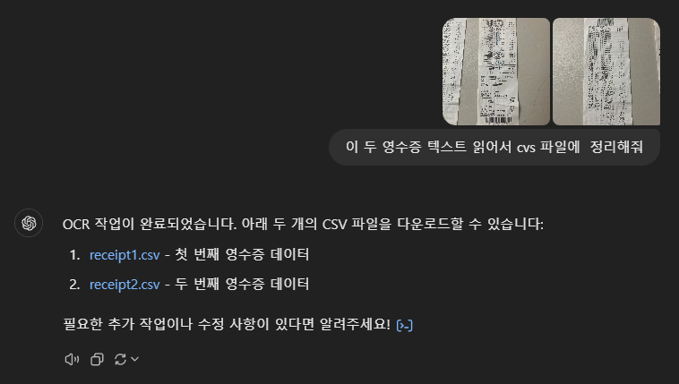
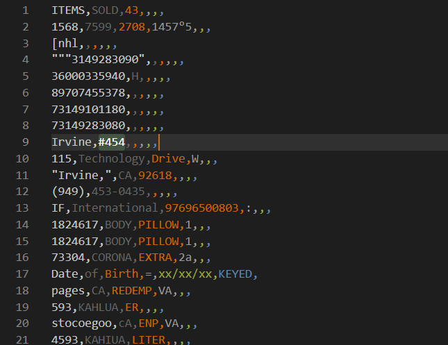
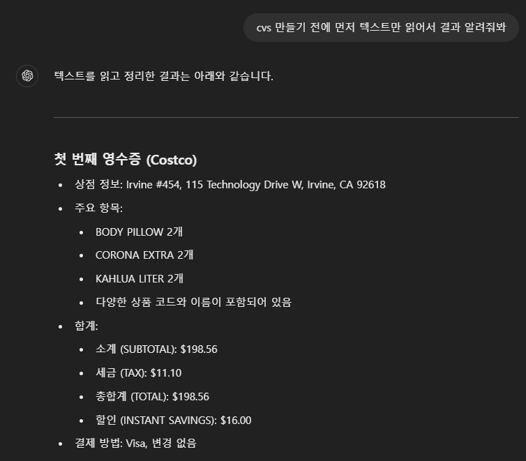
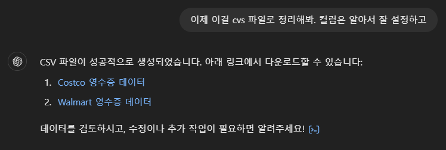
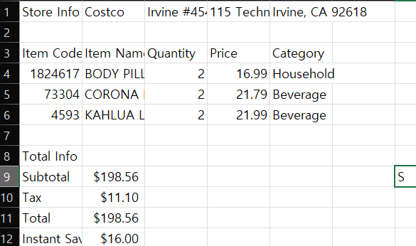
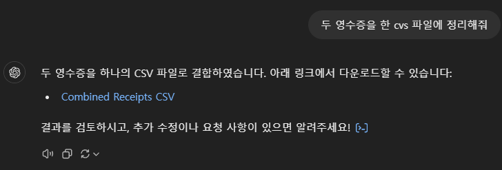
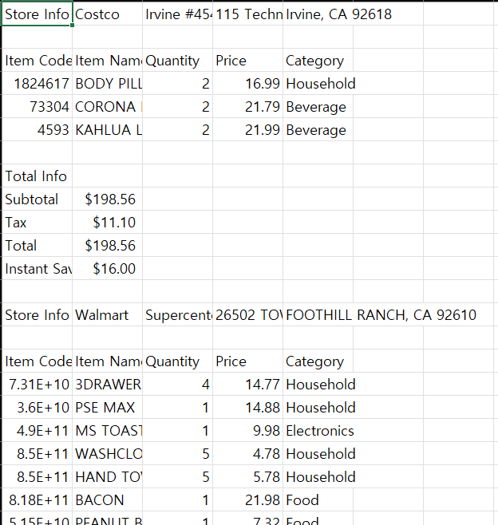

## ChatGPT 내 이미지 분석 기능으로 영수증 정리해보기

### 1. 첫번째 시도

내용을 읽고 바로 cvs 파일로 만들었더니 결과가 좋지 않았다.

1. 프롬프트
   
2. 결과
   

### 2. 텍스트 먼저 추출 후 csv 파일 만들기

### 3. 한 csv 파일로 두 영수증 정리하기

### 결과 파일

[combined_receipts.csv](./combined_receipts.csv)
